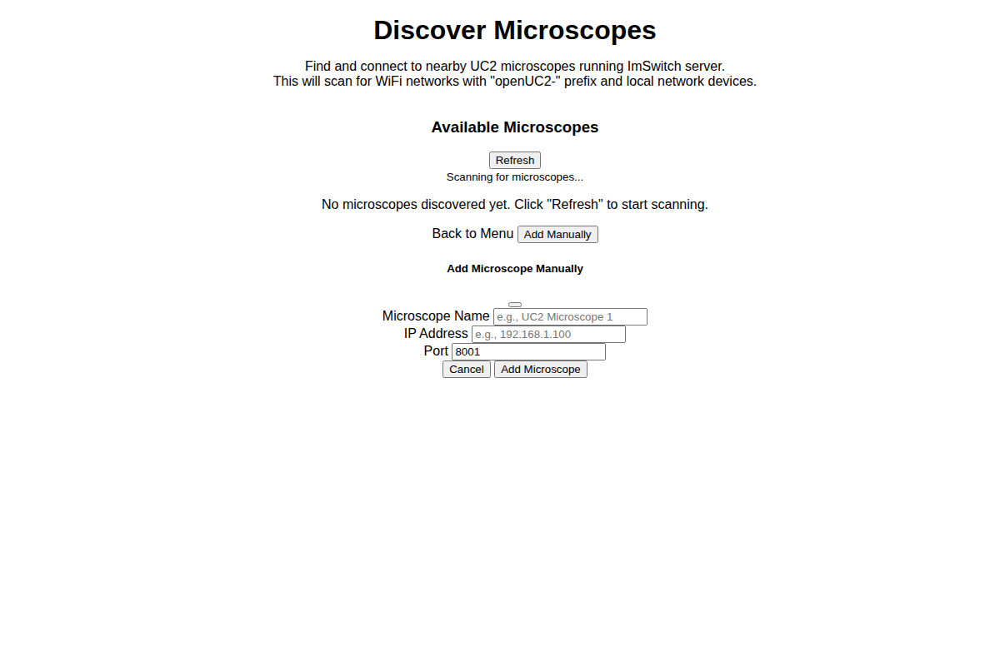
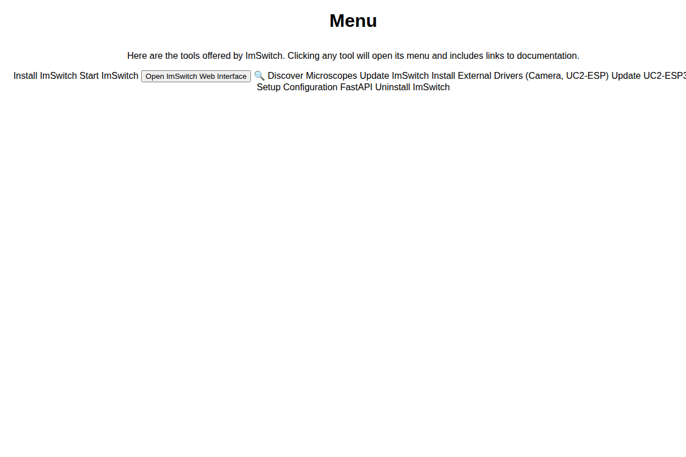

# Microscope Discovery Feature

This feature allows automatic discovery of nearby UC2 microscopes running ImSwitch server.

## How it Works

### 1. WiFi Network Scanning
- Scans for WiFi networks with SSID pattern "openUC2-XXXX"
- Assumes microscopes on WiFi hotspots use IP 192.168.4.1:8001
- Works across Windows, macOS, and Linux platforms

### 2. Local Network Scanning  
- Scans current network interfaces for IP ranges
- Tests common microscope port 8001 on each IP
- Handles self-signed certificates automatically

### 3. Microscope Verification
- Validates microscopes by checking `/openapi.json` endpoint
- Extracts version information when available
- Tests connection status in real-time

## User Interface

### Discovery Page (`pages/discoverMicroscopes.html`)
- Modern card-based interface similar to Opentrons
- Real-time discovery progress with progress bar
- Microscope status indicators (online/offline/discovering)
- Manual microscope addition capability
- Persistent storage of discovered devices

### Main Menu Integration
- Added "🔍 Discover Microscopes" button to main menu
- Prominent placement for easy access

## Features

### Automatic Discovery
- **Refresh Button**: Starts comprehensive network scan
- **Progress Tracking**: Real-time updates during scanning
- **WiFi + Network**: Dual discovery methods for maximum coverage

### Microscope Management
- **Connection Testing**: Verify microscope availability
- **Direct Connect**: Load microscope web interface
- **Remote Control**: Open API documentation for REST control
- **Persistent Storage**: Remember discovered microscopes

### Manual Addition
- **Custom IP/Port**: Add microscopes not found by scanning
- **Name Assignment**: Custom names for easy identification
- **Immediate Testing**: Verify manually added microscopes

## Technical Implementation

### Frontend (`js/discoverMicroscopes.js`)
- `MicroscopeDiscovery` class manages all discovery operations
- IPC communication with Electron main process
- Bootstrap modal for manual microscope addition
- LocalStorage for persistence

### Backend (`main.js`)
- `discoverMicroscopes()`: Main discovery coordinator
- `scanWiFiNetworks()`: Platform-specific WiFi scanning
- `scanLocalNetwork()`: IP range scanning with chunking
- `testMicroscopeConnection()`: HTTPS connection testing
- Self-signed certificate handling

### Network Protocols
- **HTTPS**: All microscope communication uses port 8001
- **OpenAPI**: Microscope identification via `/openapi.json`
- **REST API**: Control via standard HTTP methods
- **Self-signed Certs**: Automatic acceptance for local devices

## Screenshots

*Microscope discovery interface with card-based layout*

*Main menu with prominent discovery button*

## Error Handling
- Network timeouts (2-5 second limits)
- Certificate validation bypass for self-signed
- Graceful fallbacks for platform-specific commands
- User-friendly error messages

## Future Enhancements
- Real-time microscope control interface
- Batch operations across multiple microscopes
- Discovery via mDNS/Bonjour
- Custom port scanning ranges
- Microscope grouping and organization